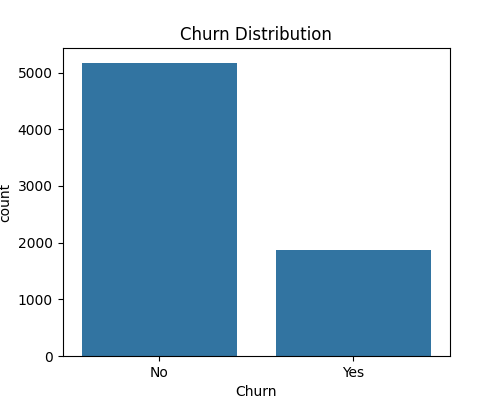
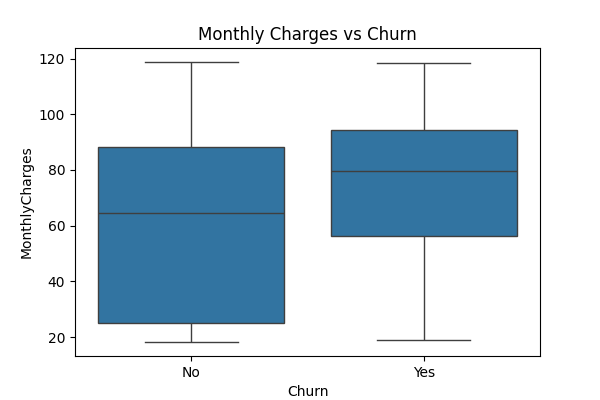
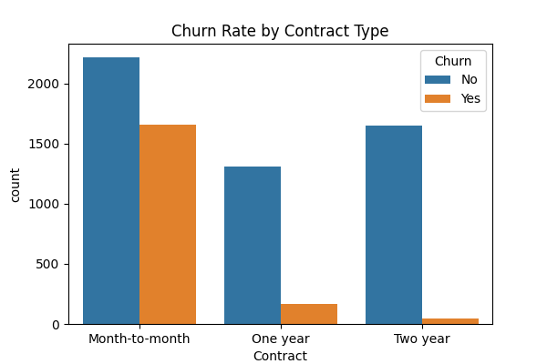
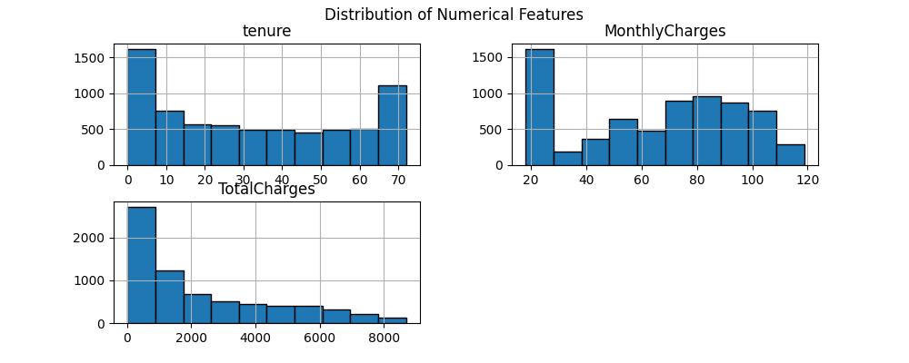

# 📊 Customer Churn Prediction — Machine Learning

This project predicts whether a telecom customer will **churn (leave)** or **stay**, using machine learning classification techniques.
The goal is to analyze customer behavior, identify churn reasons, and help businesses reduce customer loss using data-driven insights.

---

## 🎯 Project Objective

* Understand the factors that influence customer churn
* Perform Exploratory Data Analysis (EDA)
* Build a predictive model using machine learning
* Evaluate performance using accuracy and classification metrics

---

## 📂 Dataset Information

**Dataset Source:** Telco Customer Churn
**Rows:** 7043
**Target Column:** `Churn` (Yes / No)

### Key Columns

| Feature         | Description            |
| --------------- | ---------------------- |
| tenure          | months customer stayed |
| MonthlyCharges  | monthly billing amount |
| TotalCharges    | total amount billed    |
| Contract        | Contract type          |
| PaymentMethod   | billing method         |
| InternetService | internet type          |

---

## 🧠 Machine Learning Approach

| Step       | Description                                       |
| ---------- | ------------------------------------------------- |
| Encoding   | Label Encoding + One Hot Encoding                 |
| Splitting  | Train-test split (80/20)                          |
| Model      | RandomForestClassifier                            |
| Evaluation | Accuracy, Confusion Matrix, Classification Report |

### Final Result

| Metric       | Score  |
| ------------ | ------ |
| **Accuracy** | ~0.80+ |

---

## 📈 Exploratory Data Analysis (EDA)

### Churn Distribution



### Monthly Charges vs Churn



### Contract Type vs Churn



### Numeric Feature Distribution



*(More visualizations available inside `EDA.ipynb`)*

---

## 🧾 Project Structure

```
Customer-Churn-Prediction
 ┣ 📂 src
 ┃ ┗ 📄 model.py
 ┣ 📄 Customer_Churn.csv
 ┣ 📄 EDA.ipynb
 ┣ 📄 README.md
 ┣ 📄 requirements.txt
 ┣ 📄 model.pkl
 ┗ 📄 LICENSE
```

---

## 🛠 Installation & Execution

### **Clone Repository**

```bash
git clone https://github.com/Noorahmedks-2103/Customer-Churn-Prediction.git
cd Customer-Churn-Prediction
```

### **Install Requirements**

```bash
pip install -r requirements.txt
```

### **Run Model Training**

```bash
python src/model.py
```

---

## 📦 Model Output

```
Accuracy: ~0.80-0.85
Confusion Matrix:
[...]
Model saved successfully as model.pkl
```

---

## 🚀 Future Improvements

* Deploy Streamlit UI web app for predictions
* Hyperparameter tuning (GridSearchCV / XGBoost)
* Deployment on Render / AWS / HuggingFace

---

## 👨‍💻 Author

**K S Noor Ahamad**
📍 Tirupati, Andhra Pradesh
📧 [nkurnipalli34@gmail.com](mailto:nkurnipalli34@gmail.com)
🔗 LinkedIn: [www.linkedin.com/in/k-s-noor-ahmed-943403319](http://www.linkedin.com/in/k-s-noor-ahmed-943403319)
🔗 GitHub: github.com/Noorahmedks-2103

